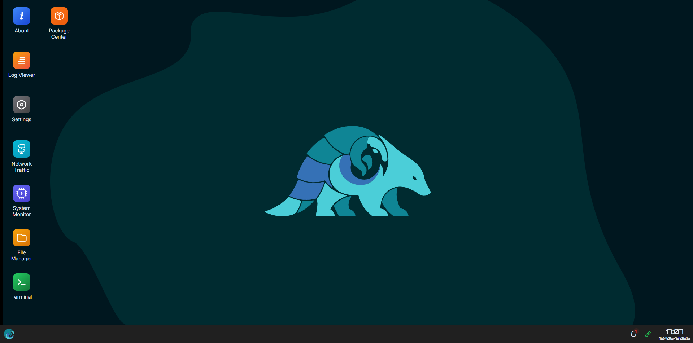
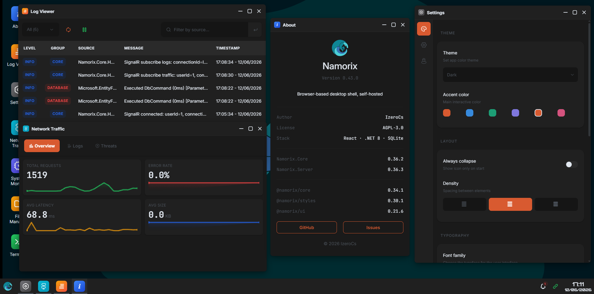

# Namorix

[](LICENSE)

<p align="center">
  
</p>

Browser-based desktop shell, self-hosted.

## Features

- **Desktop Shell** — Window manager, taskbar, launcher, desktop icon shortcuts
- **System Addons** — Built-in addons (About, NetworkTraffic, Log Viewer, Settings, SystemMonitor, File Manager, Terminal, Package Center) via addon contract
- **External Addons** — Docker-based addons with 3 modes: widget DOM slot, full app via window.open, direct URL
- **Centralized Auth** — Single auth server for shell and addons

## Screenshots




## Tech Stack

| Layer | Technology |
|-------|------------|
| Frontend | Vite + React |
| Backend | ASP.NET Core 8 |
| Database | SQLite + EF Core |
| Auth | JWT (access + refresh) with HttpOnly cookies |
| Terminal | xterm.js |
| Realtime | SignalR |
| Server-to-server | gRPC (planned) |
| Docker | Docker.DotNet |

## Quick Start

```bash
# Clone
git clone <repo-url> namorix
cd namorix

# Install dependencies (uses pnpm)
cd frontend && pnpm install

# Run development (2 terminals)
cd backend && dotnet watch run  # Backend C# (port 3000)
# or: cd backend && dotnet run
cd frontend && pnpm dev         # Frontend (Vite port 5174)
```

## Repository Structure

```
namorix/
├── frontend/
│   ├── package.json          # pnpm workspace root (port 5174)
│   ├── pnpm-workspace.yaml   # workspace config
│   ├── tsconfig.base.json    # shared TypeScript config
│   ├── public/themes/        # Compiled theme CSS (default, dark)
│   ├── packages/
│   │   ├── core/             # @namorix/core — browser-only types, utils (publishable)
│   │   │   └── src/
│   │   │       ├── addon/    # AddonEntry, NmxAddonManifest, AddonContext, defineAddon()
│   │   │       ├── auth/     # auth.service.ts (AuthChecker), store auto-populate
│   │   │       ├── cache/    # useTabCache, Show component
│   │   │       ├── env/      # Dev/prod config via package.json exports
│   │   │       ├── fingerprint/ # FingerprintComponents, generateFingerprint()
│   │   │       ├── hooks/    # usePageSize, useLocalStorage
│   │   │       ├── http/     # ApiError, http client with auto-refresh + CSRF
│   │   │       ├── i18n/     # NmxI18n, ValidationRunner, validation-messages
│   │   │       ├── router/   # GuardedRoute, createAuthGuard/LoginGuard/RegisterGuard
│   │   │       ├── signalr/  # SignalR service, hooks (useSignalR, useSignalREvent, useSignalRGroup, useSignalRStatus), constants
│   │   │       ├── store/    # nmxStore observable singleton, accessors (user, theme, registerEnabled, needsRegister)
│   │   │       ├── toast/    # NmxToastBus event emitter, nmxToast singleton (.long/.short/.success/.error/.warning/.info)
│   │   │       ├── theme/    # ThemeManifest types, loader (hot swap CSS)
│   │   │       ├── types/    # ApiResponse, ValidationErrorMeta, error codes
│   │   │       ├── utils/    # cx, isMobile, sanitizePath, format
│   │   │       ├── apiRoutes.ts
│   │   │       ├── config.ts
│   │   │       └── constants.ts
│   │   ├── styles/           # @namorix/styles — SCSS tokens, reset, fonts
│   │   │   └── src/
│   │   │       ├── base/     # Abstract (vars/mixins/maps/palette), components, layouts,
│   │   │       │               # icons (SVG), icomoon, shell (addon/components), tokens
│   │   │       ├── themes/   # Default + dark theme SCSS (compiled to public/themes/)
│   │   │       ├── shell.scss    # Shell-specific SCSS (window, taskbar, launcher, addon)
│   │   │       └── index.scss
│   │   └── ui/               # @namorix/ui — React components
│   │       └── src/
│   │           ├── Primitives/    # Self-contained: NmxButton, NmxForm, NmxIcon, NmxInlineAlert,
│   │           │                   # NmxToggle, NmxSelect, NmxSelectMultiple, NmxSlider,
│   │           │                   # NmxSegmentedGroup, NmxBadge, NmxChip, NmxLoading,
│   │           │                   # NmxPagination, NmxPulseDot, NmxSearchInput,
│   │           │                   # NmxStatCard, NmxTagInput
│   │           ├── Components/    # Composite: NmxCard, NmxDataTable, NmxDialog, NmxMetaList, NmxRail,
│   │           │                   # NmxSettings, NmxToolbar, NmxAddon, NmxAlertDialog,
│   │           │                   # NmxToastProvider, NmxTabContext, NmxTabProvider
│   │           ├── hooks/         # useHorizontalDrag
│   │           ├── context/       # NmxHostContext, useIsWindowed
│   │           ├── Layouts/       # NmxHorizontalWrap, NmxGrid
│   │           ├── types/         # Base, primitives shared types
│   │           └── utils/         # cx helpers (cx, cxSize, cxSemantic, cxVariant)
│   └── src/
│       ├── addons/           # Built-in addon registry + implementations
│       │   ├── registry.ts   # registerAddon, resolveAddon, listAddons
│       │   ├── About/           # About Namorix (version, meta, GitHub links)
│       │   ├── FileManager/     # File browser scaffold
│       │   ├── LogViewer/       # Level filter chips + multi-select, paginated table
│       │   ├── NetworkTraffic/  # Overview/Logs with SignalR + flat file backend
│       │   ├── PackageCenter/   # External addon management scaffold
│       │   ├── Settings/       # Appearance, System, Account tabs
│       │   ├── SystemMonitor/
│       │   └── Terminal/       # Terminal emulator scaffold
│       ├── components/
│       │   ├── AuthView.tsx  # Hero + form panel layout
│       │   ├── DesktopArea/  # Desktop icon shortcuts, grid layout
│       │   ├── Launcher/     # Start menu with search + system app list
│       │   ├── Taskbar/      # Clock, start button, window buttons, signal status
│       │   ├── WindowFrame/  # Draggable, resizable window chrome (6 hooks)
│       │   └── WindowManager.tsx  # Render all open windows by zOrder
│       ├── config/windowDefaults.ts # CSS token cache (read from --nmx-*)
│       ├── controllers/      # auth.controller, notification.controller, settings.controller, log.controller
│       ├── hooks/            # useTaskbarClock, useAppearanceSync, useNotificationEvents
│       ├── i18n/locales/     # en.json, vi.json, notification/en.json, notification/vi.json
│       ├── pages/            # Login, Register, Desktop, Blocked
│       ├── store/            # Redux Toolkit
│       │   ├── index.ts      # configureStore
│       │   ├── hooks.ts      # useAppDispatch, useAppSelector (shallowEqual)
│       │   ├── types.ts
│       │   ├── slices/       # windowsSlice, launcherSlice, taskbarSlice, notificationsSlice
│       │   └── selectors/    # Memoized createSelector
│       └── types/            # WindowId, WindowState, windowing types
└── backend/                   # ASP.NET Core 8 API (port 3000)
    ├── Makefile               # Build/EF commands
    ├── Namorix.sln            # Solution file
    └── src/
        ├── Namorix.Core/      # Models, Abstractions, Config, Constants, Exceptions, Responses, Validation
        └── Namorix.Server/    # Persistence (AppDbContext, SQLite migrations),
                                # Services (Auth, Permission, Settings, Theme, User, Notification,
                                #   Docker, Addon, OAuth),
                                # Controllers (Auth, Health, Permission, Settings, Theme, User,
                                #   Notification, Addon, OAuth),
                                # Middleware (Auth, TrustedProxy, RequirePermission, Csrf, Exception,
                                #   JsonError, NotFound, SecurityHeaders, TrafficMonitor, OAuth2),
                                # Workers (TokenCleanup, LogCleanup, SystemMonitorStats,
                                #   DockerMonitor, Traffic*),
                                # Hubs (MainHub, NmxHub, SignalRAddonNotifier),
                                # Infrastructure (IAddonNotifier),
                                # Extensions, Program.cs
```

## Packages

| Package | Purpose | Importable By |
|---------|---------|---------------|
| `@namorix/core` | Types, auth guards, http client with auto-refresh + CSRF, `ApiError`, i18n (NmxI18n, ValidationRunner), SignalR hooks (useSignalR, useSignalREvent, useSignalRGroup, useSignalRStatus), store (nmxStore), theme, addon contract, fingerprint, cache (useTabCache, Show), hooks (usePageSize, useLocalStorage), toast (NmxToastBus), notification (NmxNotificationDto, SignalR events, API routes) | frontend, @namorix/ui, external addons |
| `@namorix/styles` | SCSS tokens, reset, fonts, icomoon icons, component/layout SCSS (shared by all themes), shell-specific SCSS | frontend, @namorix/ui, external addons |
| `@namorix/ui` | Primitives (NmxButton, NmxForm, NmxIcon, NmxInlineAlert, NmxToggle, NmxSelect, NmxSelectMultiple, NmxSlider, NmxSegmentedGroup, NmxBadge, NmxChip, NmxLoading, NmxPagination, NmxPulseDot, NmxSearchInput, NmxStatCard, NmxTagInput) + Composite (NmxCard, NmxDataTable, NmxMetaList, NmxRail, NmxSettings, NmxToolbar, NmxAddon, NmxDialog, NmxAlertDialog, NmxToastProvider, NmxTabContext, NmxTabProvider) + NmxHostContext + Layouts (NmxHorizontalWrap, NmxGrid) | frontend |
| `backend` | ASP.NET Core 8 API server (SignalR, flat file traffic + logs, SQLite, Log pipeline, FileLogger, ValidationFilter, SecurityHeaders, CSRF, CORS) | - |
| `frontend` | Vite React shell (Redux Toolkit, SignalR client, addon system) | - |

## Auth Architecture

### Controller Pattern (Frontend)

Frontend uses controller pattern for API calls:

```typescript
// frontend/src/controllers/auth.controller.ts
import { nmxHttp, getApiBaseUrl, ApiError, ApiAuthRoutes } from "@namorix/core"

export const authController = {
  login: async (username: string, password: string, rememberMe?: boolean) => {
    const data = await nmxHttp
      .url(getApiBaseUrl() + ApiAuthRoutes.login)
      .post({ username, password, rememberMe })
      .json()
    if (!data.success) throw ApiError.fromResponse(data)
  },
  // ...
}
```

### Decorator-based Controllers (C#)

Backend uses ASP.NET Core attributes for route declaration:

```csharp
[ApiController]
[Route("api/auth")]
public class AuthController(AuthService authService) : ControllerBase
{
    [HttpPost("register")]
    [Validate(typeof(RegisterSchema))]
    public async Task<IActionResult> Register([FromBody] RegisterRequest request)
    {
        var result = await authService.Register(request.Username, request.Password);
        return Ok(ApiResponse.Ok(result));
    }
}
```

## Addon Architecture

### Internal Addons (M3 — Built-in)

System addons (NetworkTraffic, Log Viewer, Settings, SystemMonitor) sử dụng chung addon contract với external addons:
- **AddonEntry**: `mount(container, context)` / `unmount()` lifecycle
- **NmxAddonManifest**: id, displayName, description?, icon?
- **AddonContext**: addonId, locale, theme

Internal addons import tĩnh, bundle sẵn trong shell, full permission.

### External Addons (M4 — Docker)

Addon có 3 mode tích hợp:

| Mode | Cách hoạt động | Auth |
|------|----------------|------|
| **Widget** | Addon frontend render trong DOM slot trên Dashboard, mount/unmount qua `addonEntry.js` contract (`mount(container, context)` / `unmount()`) | HttpOnly cookie (same-origin) |
| **Full App** | Mở tab mới qua `window.open` từ Dashboard, addon dùng `nmx_handshake_token` để exchange lấy session | One-time token exchange |
| **Direct URL** | User nhập URL addon → addon redirect về shell xin `nmx_handshake_token` → shell redirect lại addon kèm token → addon exchange lấy session | One-time token exchange (cùng flow mode 2) |

### Communication

- **Server-to-server**: gRPC bidirectional streaming (Namorix Backend ↔ Addon Backend)
- **Frontend realtime**: SignalR (Dashboard ↔ Namorix Backend, Addon Frontend ↔ Addon Backend)
- **Shell ↔ Addon**: Event Bus (`@namorix/core`) — `shell:*` events và `addon:*` events (cùng JS context cho widget mode, postMessage cho full app mode)

## Environment Variables

### Backend (ASP.NET Core, `__` separator for hierarchy)

| Variable | Config Path | Default | Description |
|----------|-------------|---------|-------------|
| `JWT__Secret` | Jwt.Secret | (required) | JWT signing key |
| `JWT__AccessTokenExpirationMinutes` | Jwt.AccessTokenExpirationMinutes | 15 | Access token TTL |
| `JWT__RefreshTokenExpirationDays` | Jwt.RefreshTokenExpirationDays | 7 | Refresh token TTL |
| `JWT__RefreshTokenExpirationDaysRemember` | Jwt.RefreshTokenExpirationDaysRemember | 90 | Remember-me TTL |
| `ConnectionStrings__DefaultConnection` | ConnectionStrings.DefaultConnection | `Data Source=namorix.db` | SQLite connection string |
| `AppConfig__CsrfEnabled` | AppConfig.CsrfEnabled | false | Enable CSRF protection (`true` = CSRF check enabled; default false disables it) |
| `SECURE_COOKIE` | AppConfig.SecureCookie | false | Set true for HTTPS |
| `ALLOWED_ORIGINS` | AppConfig.AllowedOrigins | (empty) | Comma-separated CORS origins; empty = allow all (trusted proxy mode) |

## Milestones

1. **M1** — Static shell UI + mock auth page ✅
2. **M2** — Full auth backend (login/register/logout/refresh/session, decorators, i18n, validation) ✅
3. **M3** — System Addons (Built-in): addon contract + registry, About, Log Viewer, NetworkTraffic (SignalR + flat file storage), SystemMonitor, Settings (Appearance/System/Account), theme system (hot swap CSS, server-driven), File Manager, Terminal, Package Center
4. **M4** — External addon system (Docker lifecycle, addon manager) 🔜
5. **M5** — @namorix/core publish npm + addon integration guide
