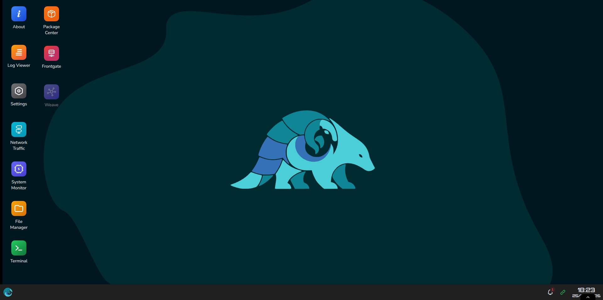
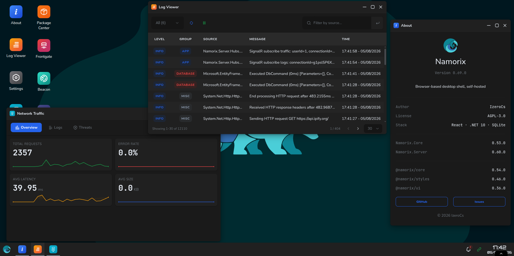
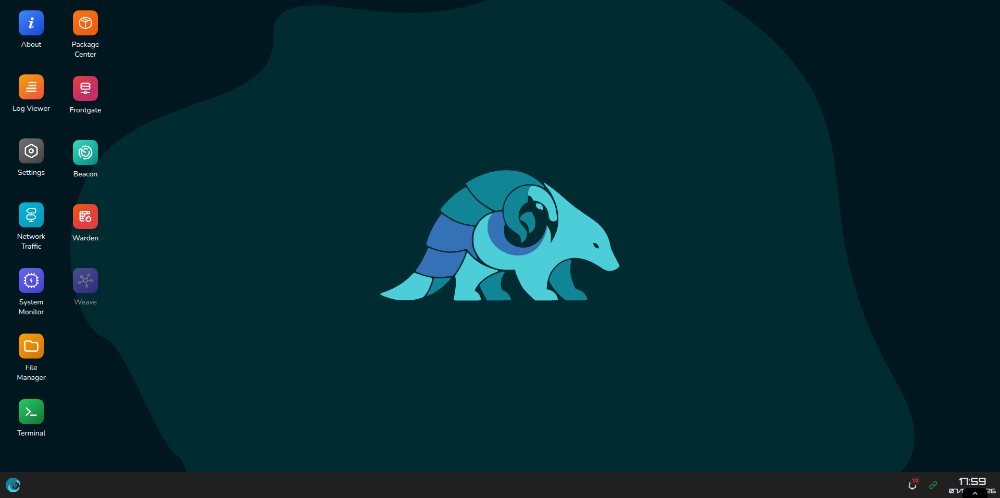

# Namorix

[](LICENSE)

<p align="center">
  
</p>

Browser-based desktop shell, self-hosted.

## Features

- **Desktop Shell** — Window manager, taskbar, launcher, desktop icon shortcuts
- **System Addons** — Built-in addons (About, NetworkTraffic, Log Viewer, Settings, SystemMonitor, File Manager, Terminal, Package Center, Frontgate, Beacon, Warden) via addon contract
- **Reverse Proxy** — YARP-based reverse proxy management (Frontgate): route traffic to addons via custom domains, SSL termination, WebSocket support, access control, audit log, rate limiting, backend health monitoring
- **External Addons** — Docker-based addons with widget (Module Federation mount) and standalone (OAuth PKCE, own server) modes
- **Centralized Auth** — Single auth server for shell and addons, OAuth2 authorization server (authorization_code + PKCE, client_credentials + private_key_jwt)

## Beacon — DDNS Updater

Updates DNS records to your current public IP (DDNS). Host hỗ trợ multi-tag (comma-separated: `@`, `www`, `*.example.com`); provider tự xử lý multi-host (Cloudflare/GoDaddy/Namecheap loop từng tag, DuckDNS batch 1 request).

| Provider | Kind | Tested |
|----------|------|--------|
| DuckDNS | GET | ✅ |
| Namecheap | GET | ✅ |
| No-IP | GET | ✅ |
| Dynu | GET | ✅ |
| Cloudflare | REST | ✅ |
| GoDaddy | REST | ⏳ |
| Custom | GET / REST | — |

## Screenshots


<table>
  <tr>
    <td width="50%"></td>
    <td width="50%"></td>
  </tr>
</table>

## Tech Stack

| Layer | Technology |
|-------|------------|
| Frontend | Vite + React |
| Backend | ASP.NET Core 10 |
| Database | SQLite + EF Core |
| OAuth | authorization_code + PKCE (browser), client_credentials + private_key_jwt (server) |
| Addon protocol | Module Federation (widget), OAuth2 standalone (full app) |
| Server-to-server | gRPC (bidirectional streaming) |
| Docker | Docker.DotNet |
| Auth | JWT (access + refresh) with HttpOnly cookies |
| Terminal | xterm.js |
| Realtime | SignalR |

## Quick Start

```bash
# Clone
git clone <repo-url> namorix
cd namorix

# Install dependencies (uses pnpm)
cd frontend && pnpm install

# Run development (2 terminals)
cd backend && dotnet watch run  # Backend C# (port 5001)
# or: cd backend && dotnet run
cd frontend && pnpm dev         # Frontend (Vite port 5000)
```

## Docker Deployment

```bash
docker compose up -d --build    # Build + run (ports 5001/5002/80/443)
```

- `Dockerfile` 3-stage: build SPA (`frontend/dist`) → publish backend → runtime `dotnet/aspnet` (SPA copy vào `/app/public`, serve bởi backend).
- `docker-compose.yml`: bind-mount `data/` (SQLite + pki) + `/var/run/docker.sock` (addon lifecycle), chạy `user: 1000:984` với `cap_add: NET_BIND_SERVICE` (bind port 80/443).
- Nếu `data/` từng được tạo bởi container chạy root: `sudo chown -R 1000:1000 data/`.
- `docker-compose.deploy.yml`: bản deploy dùng named volume `namorix-data` thay bind-mount.

## Ports

| Port | Service | Protocol | Purpose |
|------|---------|----------|---------|
| 5000 | Namorix Frontend (Vite) | HTTP | Main desktop shell dev server |
| 5001 | Namorix Backend | HTTP/1.1 | REST API + SignalR realtime |
| 5002 | Namorix Backend (gRPC) | HTTP/2 | gRPC bidirectional streaming for addon channels |
| 5100 | namorix-weave (Vite) | HTTP | Weave addon frontend |
| 5101 | namorix-weave (backend) | — | Reserved — addon backend |
| 5102 | namorix-weave (gRPC) | — | Reserved — addon gRPC |
| 5200 | namorix-beam (Vite) | HTTP | Beam addon frontend |
| 5201 | namorix-beam (backend) | — | Reserved — addon backend |
| 5202 | namorix-beam (gRPC) | — | Reserved — addon gRPC |
| 5300 | namorix-scout (Vite) | HTTP | Scout addon frontend |
| 5301 | namorix-scout (backend) | — | Reserved — addon backend |
| 5302 | namorix-scout (gRPC) | — | Reserved — addon gRPC |
| 5400 | namorix-vault (Vite) | HTTP | Vault addon frontend |
| 5401 | namorix-vault (backend) | — | Reserved — addon backend |
| 5402 | namorix-vault (gRPC) | — | Reserved — addon gRPC |

### Linux: Binding Ports Below 1024 Without Root

The Frontgate proxy uses ports 80 (HTTP) and 443 (HTTPS). On Linux, ports below 1024 require root by default. For development machines, lower the unprivileged port threshold instead of using `sudo` or `setcap`:

```bash
# Temporary (until reboot)
sudo sysctl net.ipv4.ip_unprivileged_port_start=80

# Permanent
echo 'net.ipv4.ip_unprivileged_port_start=80' | sudo tee /etc/sysctl.d/99-unprivileged-ports.conf
sudo sysctl --system
```

Setting this to 80 means all ports ≥ 80 are available to unprivileged processes — enough to cover both 80 and 443. After this, `dotnet run` on the backend can bind port 80/443 normally.

**Do not use this on production systems** — it weakens the kernel's privilege boundary. Production should use a dedicated reverse proxy (Nginx, HAProxy) or `setcap` on the binary instead.

## Repository Structure

```
namorix/
├── frontend/
│   ├── package.json          # pnpm workspace root (port 5000)
│   ├── pnpm-workspace.yaml   # workspace config
│   ├── tsconfig.base.json    # shared TypeScript config
│   ├── public/themes/        # Compiled theme CSS (light, dark)
│   ├── packages/
│   │   ├── core/             # @namorix/core — browser-only types, utils (publishable)
│   │   │   └── src/
│   │   │       ├── auth/     # auth.service.ts (AuthChecker), store auto-populate
│   │   │       ├── cache/    # useTabCache, Show component
│   │   │       ├── env/      # Dev/prod config via package.json exports
│   │   │       ├── fingerprint/ # FingerprintComponents, generateFingerprint()
│   │   │       ├── hooks/    # usePageSize, useLocalStorage
│   │   │       ├── http/     # ApiError, http client with auto-refresh + CSRF, error types
│   │   │       ├── i18n/     # NmxI18n, ValidationRunner, validation-messages
│   │   │       ├── mount/    # createMount, AddonModeProvider, useIsStandalone, useIsWidget
│   │   │       ├── oauth/    # PKCE browser client (authorizeRedirect, handleRedirectCallback)
│   │   │       ├── router/   # GuardedRoute, createAuthGuard/LoginGuard/RegisterGuard
│   │   │       ├── signalr/  # SignalR service, hooks (useSignalR, useSignalREvent, useSignalRGroup, useSignalRStatus), constants
│   │   │       ├── store/    # nmxStore observable singleton, accessors (user, theme, registerEnabled, needsRegister)
│   │   │       ├── toast/    # NmxToastBus event emitter, nmxToast singleton (.long/.short/.success/.error/.warning/.info)
│   │   │       ├── theme/    # ThemeManifest types, loader (hot swap CSS)
│   │   │       ├── types/    # ApiResponse, ValidationErrorMeta, error codes
│   │   │       ├── utils/    # cx, isMobile, sanitizePath, format
│   │   │       ├── apiRoutes.ts
│   │   │       ├── config.ts
│   │   │       └── constants.ts
│   │   ├── styles/           # @namorix/styles — SCSS tokens, reset, fonts
│   │   │   └── src/
│   │   │       ├── base/     # Abstract (vars/mixins/maps/palette), components, layouts,
│   │   │       │               # icons (SVG), icomoon, shell (addon/components), tokens
│   │   │       ├── themes/   # Default + dark theme SCSS (compiled to public/themes/)
│   │   │       ├── shell.scss    # Shell-specific SCSS (window, taskbar, launcher, addon)
│   │   │       └── index.scss
│   │   └── ui/               # @namorix/ui — React components
│   │       └── src/
│   │           ├── Primitives/    # Self-contained: NmxButton, NmxForm, NmxIcon, NmxInlineAlert,
│   │           │                   # NmxToggle, NmxSelect, NmxSelectMultiple, NmxSlider,
│   │           │                   # NmxSegmentedGroup, NmxBadge, NmxChip, NmxLoadingOverlay,
│   │           │                   # NmxSpinner, NmxPagination, NmxPulseDot, NmxSearchInput,
│   │           │                   # NmxStatCard, NmxTagInput
│   │           ├── Components/    # Composite: NmxCard, NmxDataTable, NmxDialog, NmxMetaList, NmxRail,
│   │           │                   # NmxSettings, NmxToolbar, NmxAddon, NmxAlertDialog,
│   │           │                   # NmxToastProvider, NmxTabContext, NmxTabProvider,
│   │           │                   # NmxLoadingOverlay
│   │           ├── hooks/         # useHorizontalDrag
│   │           ├── context/       # NmxHostContext, useIsWindowed
│   │           ├── Layouts/       # NmxHorizontalWrap, NmxGrid
│   │           ├── types/         # Base, primitives shared types
│   │           └── utils/         # cx helpers (cx, cxSize, cxSemantic, cxVariant)
│   └── src/
│       ├── addons/           # Built-in addon registry + implementations
│       │   ├── registry.ts   # registerAddon, resolveAddon, listAddons
│       │   ├── About/           # About Namorix (version, meta, GitHub links)
│       │   ├── Beacon/          # DNS updater — updates DNS when IP changes
│       │   ├── FileManager/     # File browser scaffold
│       │   ├── Frontgate/       # Reverse proxy management (YARP integration, CRUD UI, routing rules)
│       │   ├── LogViewer/       # Level filter chips + multi-select, paginated table
│       │   ├── NetworkTraffic/  # Overview/Logs with SignalR + flat file backend
│       │   ├── PackageCenter/   # External addon management scaffold
│       │   ├── Settings/       # Appearance, System, Account tabs
│       │   ├── SystemMonitor/
│       │   ├── Terminal/       # Terminal emulator scaffold
│       │   └── Warden/         # Host-level firewall — rules, security events, auto-ban threshold, Herald notifications
│       ├── components/
│       │   ├── AuthView.tsx  # Hero + form panel layout
│       │   ├── DesktopArea/  # Desktop icon shortcuts, grid layout
│       │   ├── Launcher/     # Start menu with search + system app list
│       │   ├── Taskbar/      # Clock, start button, window buttons, signal status
│       │   ├── WindowFrame/  # Draggable, resizable window chrome (6 hooks)
│       │   └── WindowManager.tsx  # Render all open windows by zOrder
│       ├── config/windowDefaults.ts # CSS token cache (read from --nmx-*)
│       ├── controllers/      # auth.controller, addon.controller, notification.controller, health.controller
│       ├── hooks/            # useTaskbarClock, useAppearanceSync, useNotificationEvents
│       ├── i18n/locales/     # en.json, vi.json, notification/en.json, notification/vi.json
│       ├── pages/            # Login, Register, Desktop, Blocked
│       ├── services/         # externalAddonEntry (Module Federation loader)
│       ├── store/            # Redux Toolkit
│       │   ├── index.ts      # configureStore
│       │   ├── hooks.ts      # useAppDispatch, useAppSelector (shallowEqual)
│       │   ├── types.ts
│       │   ├── slices/       # windowsSlice, launcherSlice, taskbarSlice, notificationsSlice, externalAddonsSlice
│       │   └── selectors/    # Memoized createSelector
│       └── types/            # WindowId, WindowState, windowing types
└── backend/                   # ASP.NET Core 10 API (port 5001)
    ├── Makefile               # Build/EF commands
    ├── Namorix.sln            # Solution file
    └── src/
        ├── Namorix.Core/      # Models, Abstractions, Config, Constants, Exceptions, Responses, Validation,
                    #   OAuth (client credentials, addon self-registration),
                    #   Protos (gRPC addon channel definition)
        └── Namorix.Server/    # Persistence (AppDbContext, SQLite migrations),
                                # Models (grouped theo addon domain: Addon/, Beacon/, Frontgate/),
                                # Services (Auth, Permission, Settings, User, Notification, Docker, OAuth,
                                #   AddonChannelManager, gRPC: AddonChannelService,
                                #   Beacon/ — DDNS (hostname service, update/probe queue, Providers/),
                                #   Frontgate/ — reverse proxy + ACME cert (worker, challenge, dry-run)),
                                # Controllers (Auth, Health, Permission, Settings, Theme, User,
                                #   Notification, Addon, OAuth, Frontgate, Beacon),
                                # Middleware (Auth, TrustedProxy, RequirePermission, OAuth2,
                                #   ForceSsl, AcmeChallenge),
                                # Workers (TokenCleanup, NotificationCleanup, SystemMonitorStats,
                                #   DockerMonitor, CatalogSync, BcnCheck, BcnActivityCleanup, FgCertPendingReset),
                                # Hubs (MainHub, SignalRAddonNotifier, SignalRSystemMonitorNotifier,
                                #   SignalRBeaconNotifier, SignalRNotificationNotifier),
                                # Infrastructure (IAddonNotifier, ISystemMonitorNotifier, IBeaconNotifier,
                                #   IBcnProviderClient, IPublicIpDetector),
                                # Extensions, Program.cs
```

## Packages

| Package | Purpose | Importable By |
|---------|---------|---------------|
| `@namorix/core` | Types, auth guards, **factory/instance pattern** (chỉ export factory thuần — `createNmxCore`, `createAuthRefresh`, `createHttpClient`, `createAuthService`, `createOauth`, `createThemeLoader`, `createSignalrService`, `createSignalRHooks`; state nằm trong instance closure riêng từng app — chống xung đột qua Module Federation), http client auto-refresh + CSRF, `ApiError`, i18n (NmxI18n, ValidationRunner), SignalR hooks (useSignalR, useSignalREvent, useSignalRGroup, useSignalRStatus), store (nmxStore), theme, fingerprint, cache (useTabCache, Show), hooks (usePageSize, useLocalStorage), toast (NmxToastBus), notification (NmxNotificationDto, SignalR events, API routes), oauth (PKCE browser client), mount (createMount, AddonModeProvider, useIsStandalone, useIsWidget) | frontend, @namorix/ui, external addons |
| `@namorix/styles` | SCSS tokens, reset, fonts, icomoon icons, component/layout SCSS (shared by all themes), shell-specific SCSS | frontend, @namorix/ui, external addons |
| `@namorix/ui` | Primitives (NmxButton, NmxForm {NmxFormField.rowFlex}, NmxIcon, NmxInlineAlert, NmxToggle, NmxSelect, NmxSelectMultiple, NmxSlider, NmxSegmentedGroup, NmxBadge, NmxChip, NmxLoadingOverlay, NmxSpinner, NmxPagination, NmxPulseDot, NmxSearchInput, NmxStatCard, NmxTagInput) + Composite (NmxCard, NmxDataTable, NmxMetaList, NmxRail, NmxSettings, NmxToolbar, NmxAddon, NmxDialog, NmxAlertDialog {noSpacingBody}, NmxToastProvider, NmxTabContext, NmxTabProvider, NmxTabs, NmxFormRow) + NmxHostContext + Layouts (NmxHorizontalWrap, NmxGrid) | frontend |
| `backend` | ASP.NET Core 10 API server: OAuth2 authorization server (authorization_code + PKCE, client_credentials + private_key_jwt), Docker addon lifecycle, gRPC bidirectional streaming, SignalR realtime, SQLite + EF Core, flat file traffic + logs, validation filter, CORS | - |
| `frontend` | Vite React shell (Redux Toolkit, SignalR client, addon system) | - |

## Auth Architecture

### Controller Pattern (Frontend)

Frontend uses controller pattern for API calls:

```typescript
// frontend/src/config/coreConfig.ts — instance duy nhất (factory/instance pattern, như i18n)
import {
  createNmxCore, createAuthRefresh, createHttpClient,
  createAuthService, createThemeLoader, createSignalrService, createSignalRHooks,
} from "@namorix/core"

const config = createNmxCore({
  apiBaseUrl: import.meta.env.VITE_API_URL ?? window.location.origin,
  hubsPath: "/hubs/main",
  isShellDesktop: true,
})
const authRefresh = createAuthRefresh(config)
const http = createHttpClient(authRefresh)
export const coreConfig = {
  ...config, http, authRefresh,
  auth: createAuthService({ core: config, http }),
  theme: createThemeLoader(config),
  signalr: createSignalrService({ core: config, authRefresh }),
  ...createSignalRHooks(...),
}

// frontend/src/controllers/auth.controller.ts
import { ApiError, ApiAuthRoutes } from "@namorix/core"
import { coreConfig } from "../config/coreConfig"

export const authController = {
  login: async (username: string, password: string, rememberMe?: boolean) => {
    const data = await coreConfig.http
      .url(coreConfig.getApiBaseUrl() + ApiAuthRoutes.login)
      .post({ username, password, rememberMe })
      .json()
    if (!data.success) throw ApiError.fromResponse(data)
  },
  // ...
}
```

### Decorator-based Controllers (C#)

Backend uses ASP.NET Core attributes for route declaration:

```csharp
[ApiController]
[Route("api/auth")]
public class AuthController(AuthService authService) : ControllerBase
{
    [HttpPost("register")]
    [Validate(typeof(RegisterSchema))]
    public async Task<IActionResult> Register([FromBody] RegisterRequest request)
    {
        var result = await authService.Register(request.Username, request.Password);
        return Ok(ApiResponse.Ok(result));
    }
}
```

## Addon Architecture

### Internal Addons (M3 — Built-in)

System addons (About, NetworkTraffic, Log Viewer, Settings, SystemMonitor, File Manager, Terminal, Package Center, Frontgate, Beacon, Warden) sử dụng chung addon contract với external addons:
- **AddonEntry**: `mount(container, context)` / `unmount()` lifecycle
- **NmxAddonManifest**: id, name, description?, icon?, defaultWidth?, defaultHeight?, instanceMode?
- **AddonContext**: addonId, nmxStore?, store?, isExternal?, sendCommand?

Internal addons import tĩnh, bundle sẵn trong shell, full permission.

### External Addons (M4 — Docker)

Addon có 2 mode tích hợp:

| Mode | Cách hoạt động | Auth |
|------|----------------|------|
| **Widget** | Addon frontend render trong desktop window qua Module Federation (`@module-federation/runtime`), share React + Redux store + theme cascade | HttpOnly cookie (same-origin, cùng DOM với desktop) |
| **Standalone** | Addon chạy Docker container riêng, serve `index.html` riêng, user navigate trực tiếp tới `http://localhost:{port}` | OAuth2 authorization_code + PKCE — tự động redirect authorize, exchange token, lưu in-memory |

### Communication

- **Server-to-server**: gRPC bidirectional streaming (Namorix Backend ↔ Addon Backend) cho widget event forward + heartbeat
- **Frontend realtime**: SignalR (Desktop ↔ Namorix Backend)
- **Shell ↔ Addon (Widget)**: Event Bus (`@namorix/core`) — `shell:*` events và `addon:*` events (cùng JS context)
- **Standalone addon**: Chạy hoàn toàn độc lập, gọi REST API với access_token từ OAuth flow

## Environment Variables

### Backend — Server (ASP.NET Core, `__` separator for hierarchy)

| Variable | Config Path | Default | Description |
|----------|-------------|---------|-------------|
| `JWT__Secret` | Jwt.Secret | (required) | JWT signing key |
| `JWT__AccessTokenExpirationSeconds` | Jwt.AccessTokenExpirationSeconds | 900 | Access token TTL (seconds) |
| `JWT__RefreshTokenExpirationDays` | Jwt.RefreshTokenExpirationDays | 7 | Refresh token TTL |
| `JWT__RefreshTokenExpirationDaysRemember` | Jwt.RefreshTokenExpirationDaysRemember | 90 | Remember-me TTL |
| `JWT__Issuer` | Jwt.Issuer | `Namorix` | JWT issuer claim |
| `JWT__Audience` | Jwt.Audience | `Namorix` | JWT audience claim |
| `ConnectionStrings__DefaultConnection` | ConnectionStrings.DefaultConnection | `Data Source=namorix.db` | SQLite connection string |
| `AppConfig__CsrfEnabled` | AppConfig.CsrfEnabled | false | Enable CSRF protection |
| `AppConfig__SecureCookie` | AppConfig.SecureCookie | false | Set true for HTTPS |
| `AppConfig__AllowedOrigins` | AppConfig.AllowedOrigins | (empty) | Comma-separated CORS origins; empty = allow all (trusted proxy mode) |
| `Backend__Port` | Backend.Port | 5001 | Backend listen port |
| `Backend__ContainerName` | Backend.ContainerName | `namorix-server` | Docker container name |
| `Backend__NetworkName` | Backend.NetworkName | `namorix-net` | Docker network name |
| `Backend__RegistrationTokenTtlMinutes` | Backend.RegistrationTokenTtlMinutes | 60 | Addon registration token TTL |
| `AddonCatalog__CatalogUrl` | AddonCatalog.CatalogUrl | (see appsettings) | Addon catalog manifest URL |
| `AddonCatalog__TtlSeconds` | AddonCatalog.TtlSeconds | 3600 | Catalog cache TTL |
| `AddonCatalog__SyncIntervalSeconds` | AddonCatalog.SyncIntervalSeconds | 3600 | Catalog sync interval |
| `AddonCatalog__RetryDelaySeconds` | AddonCatalog.RetryDelaySeconds | 60 | Catalog sync retry delay |

### Backend — Addon Client (consumed by `@namorix/core` OAuth2 library in addon containers)

| Variable | Config Path | Default | Description |
|----------|-------------|---------|-------------|
| `NMX_DESKTOP_API_URL` | NmxAddonConfig.DesktopApiUrl | (required) | Namorix backend base URL |
| `NMX_REGISTRATION_TOKEN` | NmxAddonConfig.RegistrationToken | (optional) | One-time token for addon self-registration |
| `NMX_DATA_DIR` | NmxAddonConfig.DataDir | `./data` | Addon data directory |

## Milestones

1. **M1** — Static shell UI + mock auth page ✅
2. **M2** — Full auth backend (login/register/logout/refresh/session, decorators, i18n, validation) ✅
3. **M3** — System Addons (Built-in): addon contract + registry, About, Log Viewer, NetworkTraffic (SignalR + flat file storage, API/Proxy source filter), SystemMonitor, Settings (Appearance/System/Account), theme system (hot swap CSS, server-driven), File Manager, Terminal, Package Center
4. **M4** — External addon system: Docker lifecycle, OAuth2 (client_credentials + private_key_jwt + authorization_code + PKCE), gRPC bidirectional streaming, addon catalog sync, standalone mode, web UI ✅
    - **Frontgate addon**: YARP reverse proxy with runtime config reload, CRUD API and management UI (Phase 1 ✅), certificate management (Phase 2 ✅ — LE HTTP-01 + dry-run test, custom cert upload/download, auto-renew/SNI; DNS-01 dropped), access control (Phase 3 ✅ — Access Policy CRUD, IP allowlist/denylist, Geo blocking, BasicAuth, dry-run), audit log + rate limiting + backend health (Phase 4 ✅), GeoIP database management (✅ — upload/rollback với backup `.bak` + progress)
    - **Warden addon**: host-level firewall — rules CRUD + iptables/nftables enforcement (Phase 1-2 ✅ — event publishing từ AcmeChallenge/Scan404, threshold engine + auto-ban theo security profile Low/Medium/High/Custom), Herald notifications (Phase 4 ✅ — `warden:ruleApplied`/`ruleRemoved` cho admin), Overview/Activity/Rules dashboard tabs + stats realtime qua SignalR (Phase 3 ✅), Activity Clear (xóa toàn bộ security events qua confirm dialog)
5. **M5** — @namorix/core publish npm + addon integration guide
